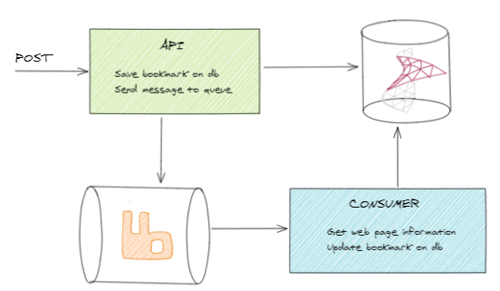

# Bookmark Manager

A simple bookmark manager written in C#

## Technologies

- `aspnet core 5`
- `sql server`
- `ef core 5`
- `rabbit mq`

## Architecture



Adding a bookmark to Bookmark Manager is executed in two steps:
1. Saves the provided URL on the DB and sends a message to RabbitMQ
1. A consumer process the message fetching the url details from the site response

To make sure that bookmarks saved on te DB are always processed by the consumer it is used the [Outbox Pattern](https://microservices.io/patterns/data/transactional-outbox.html).

## Running locally

```sh
# start dependencies
docker-compose up -d db queue

# see help
dotnet run -- -h

# run api
dotnet run -- api

# run consumer
dotnet run -- bookmark-inserted-consumer
```

## References

- https://docs.microsoft.com/en-us/aspnet/core/tutorials/first-web-api?view=aspnetcore-5.0&tabs=visual-studio
- https://medium.com/@sergiobarriel/how-to-automatically-validate-a-model-with-mvc-filter-and-fluent-validation-package-ae51098bcf5b
- https://www.rabbitmq.com/dotnet-api-guide.html#connection-and-channel-lifspan
- https://github.com/Tyrrrz/CliFx?utm_source=csharp&utm_medium=email&utm_campaign=digest#quick-start
- https://devblogs.microsoft.com/aspnet/improvements-in-net-core-3-0-for-troubleshooting-and-monitoring-distributed-apps/
- https://docs.microsoft.com/en-us/aspnet/core/fundamentals/host/hosted-services?view=aspnetcore-5.0&tabs=visual-studio#timed-background-tasks
- https://github.com/davidfowl/AspNetCoreDiagnosticScenarios/blob/master/AsyncGuidance.md#timer-callbacks
- https://altkomsoftware.pl/en/blog/microservices-outbox-rabbitmq/